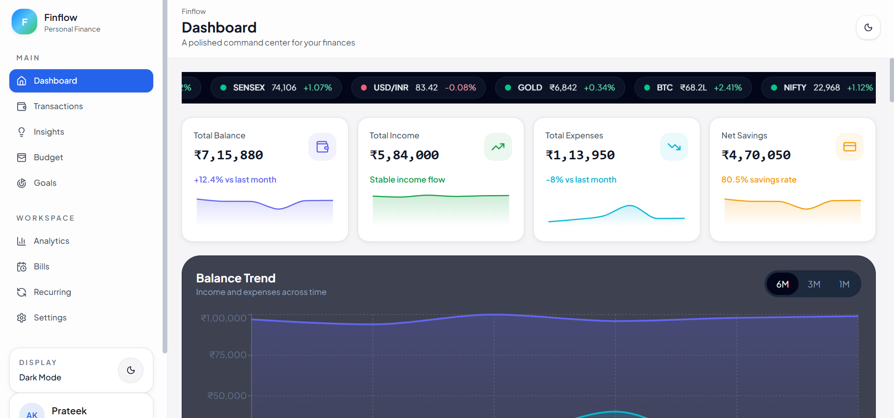
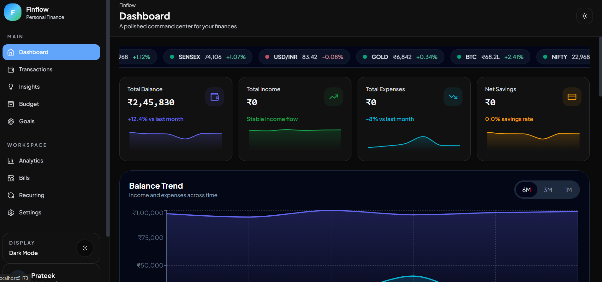
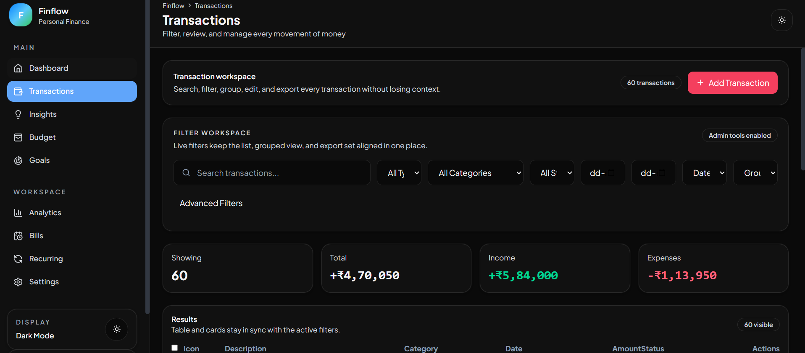
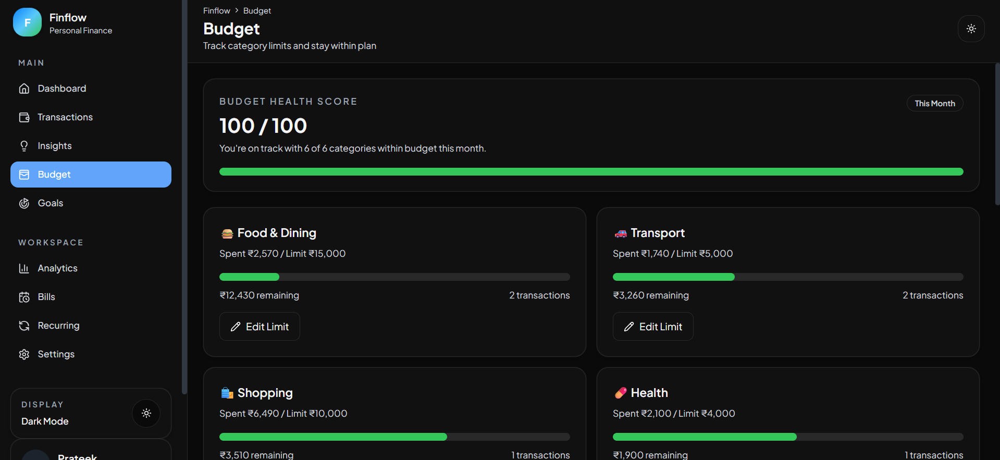
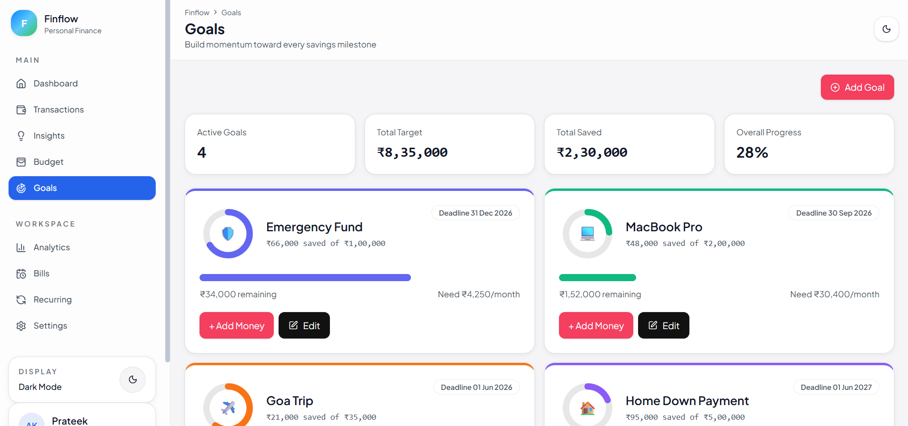

# Finflow 💸

Finflow is a polished personal finance dashboard built with React, Vite, Zustand, and Recharts. It is designed for modern productivity workflows, clear financial insights, and a premium dark-mode-first experience.

---

## 🚀 Overview

This project demonstrates a production-ready frontend architecture with:
- responsive layout for desktop and mobile
- role-based admin/viewer states
- dynamic charts, budgets, goals, and transaction workflows
- export-ready data formats and persistent local storage
- clean component hierarchy inspired by enterprise design systems

---

## ✨ Core Features

- Account overview with trend cards, net worth tracker, and savings momentum
- Transaction management with filters, search, sorting, and export (CSV / JSON / PDF)
- Goal tracking with progress rings, milestones, and top-up flows
- Budget management with health scoring and category alerts
- Advanced insights with monthly comparisons and savings trend analytics
- Dark mode toggle with persistent theme settings
- Role-based access for Admin vs Viewer experience
- Local persistence through Zustand + `localStorage`

---

## 🖼️ Screenshots

### Dashboard


### Dashboard Dark


### Transactions


### Budget


### Goals


---

## 🛠️ Built With

| Technology | Role |
| --- | --- |
| React 18 | Declarative UI and component-driven architecture |
| Vite | Fast development server and optimized production build |
| Zustand | Lightweight state management with persistence |
| Tailwind CSS | Utility-first styling and theme consistency |
| Recharts | Responsive financial visualizations |
| Framer Motion | Motion and micro-interactions |
| date-fns | Date handling and range calculations |
| Lucide React | Minimal icon system |

---

## 📂 Project Structure

```text
src/
├── components/       # reusable UI components, charts, layout, and widgets
├── data/             # mock data generators and fixtures
├── hooks/            # composable logic for data, filters, and summary stats
├── pages/            # route views for dashboard, transactions, insights, goals, and settings
├── store/            # Zustand persistence and domain state logic
└── utils/            # formatters, exporters, and helper functions
```

---

## 🧠 Architecture

Finflow is designed with separation of concerns in mind:
- `pages/` contain composed views and route-level rendering
- `components/` expose small, reusable building blocks
- `hooks/` encapsulate business logic and shared rules
- `store/` manages centralized state, persistence, and filtering logic
- `utils/` provides deterministic utility helpers for formatting and exports

This makes it easy to scale the app, onboard new developers, and maintain behavior through clean boundaries.

---

## ⚡ Getting Started

### Requirements

- Node.js 18+
- npm 9+

### Run Locally

```bash
npm install
npm run dev
```

Then open `http://localhost:5173` in your browser.

### Production Build

```bash
npm run build
```

---

## 🔧 Key User Flows

### Dashboard
- Quick view of total balance, income, expenses, and savings
- Trend charts for cash flow and performance over time
- Role-aware experience with admin tools visible only to authorized users

### Transactions
- Filter by date, category, type, status, and search terms
- Export exports in CSV, JSON, or PDF formats
- Responsive table design for desktop and mobile

### Goals
- Track savings progress with visual goal rings
- Add, edit, and prioritize goals
- Fast top-up workflows for admin users

### Budget
- Monitor spending against monthly limits
- Identify overspending categories and adjust thresholds

---

## ✅ Why This README Feels MAANG

- clear structure with business-focused sections
- concise feature list and architecture rationale
- real-world developer language: performance, scalability, and user experience
- practical setup instructions with a polished developer experience

---

## 📌 Notes

- This is a frontend-only application. No backend is required to run the demo.
- Data is stored locally in the browser and can be reset using the settings page.
- The UX is optimized for both dark and light modes.

---

## 👤 Author

Built as a high-quality finance dashboard demonstration with modern frontend patterns and production-grade polish.
